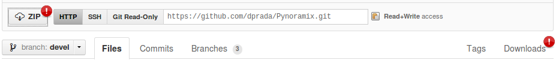

Getting Started
*******************

Getting Pynoramix
=================

Last developing version (0.1)
+++++++++++++++++++++++++++++

The last **developing** version can be obtained with any of the following procedures:

Web
...

The source code can be downloaded in the web page https://github.com/dprada/Pynoramix.git as a zip or tar.gz file.
Both options can be found with the options "zip" or "Downloads":

Git
...
The project can be clone with git with the following command:

.. sourcecode:: bash

   git clone git://github.com/dprada/Pynoramix.git

This former option is recommended. The newest corrections and functions can be easily obtained with "git pull".

.. Todo::
   -Adding the project in easy_install or setup.py (http://packages.python.org/an_example_pypi_project/setuptools.html#registering-your-project)
   -Links to raolab.com or GitHub from raolab.

Source Code
+++++++++++

The whole project is public available at https://github.com/dprada/Pynoramix.git .

There is not a stable version yet, for this reason the use of these libraries it is under your responsability.

New functions or corrections are updated daily. Because of this, it is highly recommended keep an eye on the history of the project:

https://github.com/dprada/Pynoramix/commits/devel

Installing
===========

Pynoramix depends on some packages:

- NumPy
- f2py
- python-dev (to fix the problem with file Python.h)
- liblapack and liblapack-dev (or similar: atlas, blas...)

After solving the dependencies, the script INSTALL needs to be executed to compile the fortran core of Pynoramix.

.. sourcecode:: bash

   ./INSTALL

.. warning:: Do not forget to add Pynoramix to your python path:
   - export PYTHONPATH=$PYTHONPATH:/path/to/Pynoramix

Being updated
=============

The last modifications can be easily downloaded if you made a git clone.
The command 'git pull' can be executed over the Python directory to check and obtained the changes.

Once this has been done, it is recommended to clean old libraries and compile them again:

.. sourcecode:: bash

   ./CLEAN
   ./INSTALL

